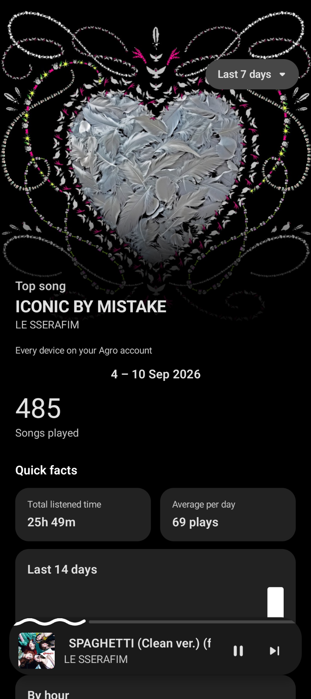

<p align="center">
  
</p>

<h1 align="center">Agro</h1>

<p align="center">
  Open-source, self-hosted music ecosystem for <a href="https://github.com/Kolbxyz/wander">Wander</a> and <a href="https://github.com/AgroUPlus/Wanda">Wanda</a>
</p>

<p align="center">
  <a href="https://agrouplus.github.io/Agro">Website</a> ·
  <a href="SECURITY.md">Security</a> ·
  <a href="SHARE_LINKS.md">Share Links</a> ·
  <a href="CONTRIBUTING.md">Contributing</a>
</p>

---

Agro is a lightweight Rust daemon that keeps playback state, library sync, and social presence in one place — so a session started on your desktop can be picked up on your phone, and your friends can follow along if you let them.

- **GraphQL API** — `POST /graphql` (schema definition language at `/graphql/sdl`, interactive GraphiQL client at `/graphql/playground`)
- **REST API docs** — Swagger UI at `/api/docs` (raw OpenAPI spec at `/api/docs/openapi.json`), covering the handful of REST endpoints — auth, uploads, relay, SSO, share links — that exist because GraphQL is a poor fit for them
- **Live push** — `GET /ws/sync` (WebSocket: `HANDOFF`, `NODE_UPDATE`, `SETTINGS_SYNC`, `LIBRARY_UPDATED`, `SYNC_OFFER`, `FRIEND_PRESENCE`, `FRIEND_REQUEST`, `LISTEN_ALONG`)
- **Embedded dashboard** — served at `/`, compiled into the binary
- **SQLite storage** — single file, no external database

> **Privacy first.** Every social surface defaults off. `HANDOFF` and `FRIEND_PRESENCE` carry sealed metadata when the sender holds a vault key — see [SECURITY.md](SECURITY.md).

---

## Screenshots

<p align="center">
  
  
  
  
</p>

---

## Build

The React dashboard is embedded into the Rust binary via `rust-embed`, so **build the dashboard first** — a fresh clone has no `dashboard/dist/` and `cargo build` will fail.

```bash
cd dashboard && npm ci && npm run build
cd .. && cargo build --release
```

Requires a Rust toolchain and Node 20+. SQLite is bundled — no system dependency needed.

---

## Run

```bash
PORT=1674 ./target/release/agro
```

`PORT` defaults to `8700`. The listener always binds `0.0.0.0`. The database path is **relative** (`agro_data.db`), so run from the directory you want the data to live in — under systemd, set `WorkingDirectory`.

### Environment

| Variable | Description |
|---|---|
| `PORT` | Listen port. Default `8700`. |
| `AGRO_PUBLIC_URL` | Base URL used to build share links. |
| `AGRO_LIBRARY_ROOT` | Music library root. **Unset = index-only**: Agro tracks what each device holds but never keeps the bytes itself. |
| `AGRO_SPOOL_ROOT` | Staging for in-flight uploads and peer transfers. Default `./spool`. |
| `AGRO_SPOOL_MAX_BYTES` | Spool budget, oldest evicted first. Default 2 GiB. |
| `AGRO_SPOOL_TTL_HOURS` | How long a spooled file waits to be collected. Default 72 h. |
| `AGRO_ARCHIVE_HOOK` | Shell command run after a file is filed. Paths arrive via env, not argv. |
| `AGRO_ALLOWED_ORIGIN` | CORS origin for the dashboard. No wildcard. |
| `AGRO_SIGNUP` | `approval` (default), `invite`, or `closed`. |

**Archive hook example** (Nextcloud):
```ini
Environment=AGRO_ARCHIVE_HOOK=docker exec -u www-data nextcloud php occ files:scan --path="alpha/files/Music"
```
Archived files are created `0664` — a setgid library shared with another service stays writable by both.

### systemd

```ini
[Unit]
Description=Agro sync server
After=network-online.target

[Service]
Type=simple
User=agro
SupplementaryGroups=www-data
UMask=0002
WorkingDirectory=/opt/agro
Environment=PORT=1674
Environment=AGRO_LIBRARY_ROOT=/srv/music
ExecStart=/opt/agro/agro
Restart=always
RestartSec=5
ProtectSystem=strict
ReadWritePaths=/opt/agro /srv/music
PrivateTmp=true
NoNewPrivileges=true

[Install]
WantedBy=multi-user.target
```

```bash
systemctl enable --now agro
journalctl -fu agro
```

### Behind a reverse proxy

Agro speaks plain HTTP and expects TLS to be terminated upstream. Three routes need non-default proxy config:

| Route | Issue with defaults |
|---|---|
| `GET /ws/sync` | Needs WebSocket upgrade — clients silently never receive pushes. |
| `PUT /api/v1/library/upload/{id}` | Rejected at `client_max_body_size` (nginx default 1 MB). |
| `/api/v1/relay/{id}/send` + `/receive` | With `proxy_buffering on` the receiver gets nothing until a buffer fills — transfer hangs, then times out. |

#### Caddy *(recommended — no config needed)*

```caddyfile
agro.example.com {
    reverse_proxy 127.0.0.1:1674
}
```

#### Nginx Proxy Manager

Enable **Websockets Support**, then add to **Advanced → Custom Nginx Configuration**:

```nginx
client_max_body_size 0;

location /api/v1/relay/ {
    proxy_pass http://192.168.1.16:1674;
    proxy_http_version 1.1;
    proxy_buffering off;
    proxy_request_buffering off;
    proxy_read_timeout 1h;
    proxy_send_timeout 1h;
    proxy_set_header Host $host;
    proxy_set_header X-Real-IP $remote_addr;
}
```

#### Plain nginx

```nginx
location / {
    proxy_pass http://127.0.0.1:1674;
    proxy_http_version 1.1;
    client_max_body_size 0;
    proxy_set_header Host $host;
    proxy_set_header Upgrade $http_upgrade;
    proxy_set_header Connection "upgrade";
}

location /api/v1/relay/ {
    proxy_pass http://127.0.0.1:1674;
    proxy_http_version 1.1;
    proxy_buffering off;
    proxy_request_buffering off;
    proxy_read_timeout 1h;
    proxy_send_timeout 1h;
}
```

### Sizing

Building requires ~4 GB RAM and ~12 GB disk. The running server idles at 20–30 MB RSS. Use `cargo build --release -j2` if memory is tight.

---

## Quickstart

The server starts with no accounts. On an empty database it prints a **one-time setup token** to the log — valid until the next restart.

**1. Start the server and find the token:**
```bash
journalctl -u agro | grep -A2 'setup token'
```

**2. Create the first administrator:**
```bash
curl -s -X POST https://agro.example.com/api/v1/bootstrap \
  -H 'Content-Type: application/json' \
  -d '{"setupToken":"<from the log>","username":"alpha"}'
```
The response carries the **passphrase** and a device token — both shown once. Save the passphrase; there is no reset.

**3. Sign in to the dashboard** with the username and passphrase.

**4. Pair devices.** Clients send the passphrase once to `/api/v1/login` and receive a per-device token:
```bash
curl -s -X POST https://agro.example.com/api/v1/login \
  -H 'Content-Type: application/json' \
  -d '{"username":"alpha","passphrase":"<your passphrase>","label":"Pixel 10"}'
```

- **Wanda (Android)** — Settings → Agro Device, or scan the QR from the dashboard's Pairing tab.
- **Wander (Linux TUI)** — `~/.config/wander/config.toml`:
  ```toml
  [agro]
  enabled = true
  server   = "https://agro.example.com"
  username = "alpha"
  passphrase = "<device token>"
  device_id  = "wander-desktop"
  sync_settings = true
  ```

`revokeAppPassword(userId:, label:)` revokes a single device — a lost phone is removed without affecting anything else.

---

## Multi-user & social

Set `AGRO_SIGNUP` and `POST /api/v1/signup` opens to strangers:

| `AGRO_SIGNUP` | Behaviour |
|---|---|
| `approval` | Anyone may register; accounts start `pending` until approved in the dashboard's **People** tab. An invite code skips the queue. |
| `invite` | A valid code is required to register. |
| `closed` | Registrations refused. |

### Privacy model

A friendship is a door, not a window — every social surface is gated on the **account being looked at**, and **every switch defaults off**:

| Switch | What it reveals |
|---|---|
| `showNowPlaying` | Friends may see what you're playing and listen along. |
| `showStats` | Friends may see your listening stats and taste overlap. |
| `discoverable` | You appear in `searchUsers` — the only way a stranger can find you. |

Search is prefix-anchored and returns only discoverable, active accounts. Blocking is symmetric and never disclosed to the blocked account. Every refusal on this path is deliberately identical — error messages cannot be used to walk the directory.

`src/social_boundary_tests.rs` keeps these guarantees from quietly reopening.

---

## Share links

With `AGRO_PUBLIC_URL` set and Share Links configured in the dashboard, Wanda and Wander replace server-specific URLs (Navidrome, YouTube) with `https://your-domain/listen?v=<id>`. Agro forwards whoever opens one to where the track actually lives.

Set up in the dashboard under **Share Links**:
1. **Share Domain** — your domain, pointed at this server.
2. **Forward To** — your music server's host(s). Everything not listed is refused.
3. **On** → **Sync to Devices**.

`/listen` is public and records nothing.

The wire format is in [`SHARE_LINKS.md`](SHARE_LINKS.md).

---

## Authentication

All `/graphql` and `/ws/sync` requests require `Authorization: Bearer <device token>`. WebSocket handshakes also accept `?token=`.

**A passphrase is not a bearer token.** It is Argon2-hashed, accepted only by `/api/v1/login`, which returns a per-device credential you can revoke independently.

Public routes (no token needed):

| Route | Purpose |
|---|---|
| `POST /api/v1/bootstrap` | Creates the first admin. Requires the setup token; refused once any account exists. |
| `POST /api/v1/login` | Trades a passphrase for a device token. |
| `POST /api/v1/signup` | Registers a new user, when `AGRO_SIGNUP` allows it. |
| `GET /share/{token}`, `GET /listen` | Capability URLs — the token in the path is the credential. |

All three mutation routes are rate-limited (10 attempts / 5 min per IP).

Full request/response shapes for every REST endpoint, including error responses, are documented interactively at `/api/docs`.

---

## Security

- Passphrases stored as **Argon2** hashes; device tokens as **SHA-256** hashes — the database holds no replayable credential.
- Every GraphQL field that names a `userId` checks it against the token's identity and answers `Forbidden` otherwise.
- `guest_boundary_tests.rs` and `social_boundary_tests.rs` enforce these boundaries under `cargo test`.
- The archive hook receives file paths via environment variables, not argv — client-supplied filenames cannot reach the shell parser.

`agro_data.db` holds listening history and should not be world-readable (it is gitignored).

---

## Deploying

```bash
./deploy.sh <user@host>
# or: AGRO_DEPLOY_HOST=user@host ./deploy.sh
```

Builds the dashboard and the server locally (the Rust binary inside a Debian 12 container for glibc compatibility), uploads the result, and restarts the service. The target never compiles anything.

---

## Licence

**AGPL-3.0** — see [`LICENSE`](LICENSE).

Section 13 is the part that matters for a server: run a modified Agro where other people can reach it and those people must be offered its source. The project is given away; what is sold is running it.

Contributions require agreement to [`CLA.md`](CLA.md) — see [`CONTRIBUTING.md`](CONTRIBUTING.md).
